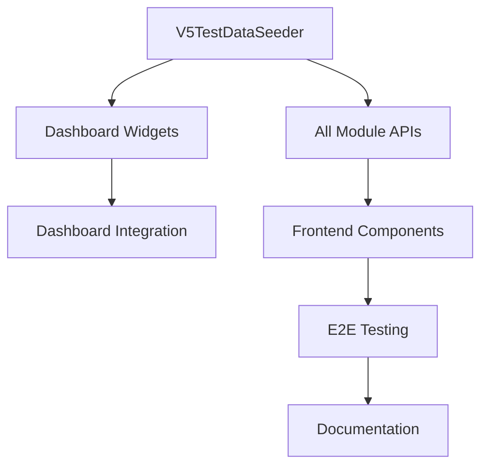

# 📋 Sprint 2025-08-13-15: Detailed Tasks Breakdown

## 📅 Daily Task Distribution

### 🗓️ **MIÉRCOLES 13 AGOSTO** (8-9 horas)

#### 🚀 **Task Group 1: Dashboard V5 - Datos Reales** 
*Priority: HIGH | Estimated: 4-5h | Story Points: 8*

##### **1.1 Backend Data Layer** (1.5h)
- [ ] **T1.1.1** - Crear `V5TestDataSeeder` profesional
  - 50+ clientes suizos realistas  
  - 15+ cursos ski/snowboard con precios CHF
  - 200+ bookings distribuidos 6 meses
  - 8+ monitors con especialidades
  - Financial data realista
  - **DoD**: Seeder ejecutable que genera datos consistentes

- [ ] **T1.1.2** - Backend Analytics API endpoints
  - `GET /api/v5/dashboard/stats` - Métricas generales
  - `GET /api/v5/dashboard/revenue` - Datos financieros  
  - `GET /api/v5/dashboard/bookings` - Reservas por período
  - **DoD**: APIs funcionando con datos del seeder

##### **1.2 Frontend Widgets** (2h)
- [ ] **T1.2.1** - `ReservationsWidget` dinámico
  - Conectar con API real `/dashboard/bookings`
  - Loading states y error handling
  - Comparativa mes anterior
  - **DoD**: Widget muestra datos reales con animaciones

- [ ] **T1.2.2** - `RevenueWidget` con gráficos
  - Integrar ApexCharts con datos reales
  - Métricas: Total, Pendiente, Completado
  - Gráfico de tendencia 6 meses
  - **DoD**: Gráficos responsive con datos reales

- [ ] **T1.2.3** - `ClientsWidget` y `MonitorsWidget`
  - Contadores dinámicos con animación
  - Estados activo/inactivo
  - Quick actions (añadir cliente, ver monitor)
  - **DoD**: Widgets interactivos completamente funcionales

##### **1.3 Dashboard Integration** (1h)
- [ ] **T1.3.1** - Dashboard optimization
  - Auto-refresh cada 5 min
  - Global loading state
  - Error boundary implementation
  - **DoD**: Dashboard fluido y sin errores

---

#### 🚀 **Task Group 2: Clients Module V5** 
*Priority: HIGH | Estimated: 3-4h | Story Points: 5*

##### **2.1 Backend API** (1.5h)
- [ ] **T2.1.1** - `ClientV5Controller` complete
  - CRUD endpoints: GET, POST, PUT, DELETE `/api/v5/clients`
  - Filtros: `?season_id=X&search=Y&status=Z`
  - Paginación y sorting
  - **DoD**: API RESTful completa y documentada

- [ ] **T2.1.2** - `ClientV5Service` business logic
  - Validaciones server-side
  - Multi-tenant filtering (school_id)
  - Season-aware client management
  - **DoD**: Lógica de negocio robusta

##### **2.2 Frontend Components** (1.5h)
- [ ] **T2.2.1** - `ClientListV5Component`
  - Tabla responsive con filtros
  - Search en tiempo real
  - Actions: Create, Edit, Delete, View
  - **DoD**: Lista funcional con todos los filtros

- [ ] **T2.2.2** - `ClientFormV5Component`
  - Formulario reactivo con validaciones
  - Campos: Personal, Contact, Preferences
  - Modal o página según UX
  - **DoD**: CRUD completo funcional

---

### 🗓️ **JUEVES 14 AGOSTO** (7-9 horas)

#### 🚀 **Task Group 3: Courses Module V5**
*Priority: MEDIUM | Estimated: 4-5h | Story Points: 8*

##### **3.1 Backend Complex Logic** (2.5h)
- [ ] **T3.1.1** - `CourseV5Controller` with pricing
  - CRUD con pricing models (fixed/flexible)
  - Groups/subgroups management
  - Monitor assignment logic
  - **DoD**: Controller completo con business logic

- [ ] **T3.1.2** - `CoursePricingV5Service`
  - Price calculation engine
  - Multi-participant pricing
  - Season-based pricing
  - **DoD**: Pricing system funcional

##### **3.2 Frontend Advanced** (2h)
- [ ] **T3.2.1** - `CourseListV5Component`
  - Filtros: Sport, Level, Monitor, Dates
  - Course cards con pricing preview
  - Availability indicators
  - **DoD**: Lista avanzada con filtros

- [ ] **T3.2.2** - `CourseFormV5Component`
  - Multi-step form (Basic → Pricing → Schedule)
  - Drag&drop para groups/subgroups
  - Preview de pricing
  - **DoD**: Formulario complejo funcional

---

#### 🚀 **Task Group 4: Bookings Module V5 Base**
*Priority: MEDIUM | Estimated: 3-4h | Story Points: 6*

##### **4.1 Backend Foundation** (2h)
- [ ] **T4.1.1** - `BookingV5Controller` basic CRUD
  - States: Pending, Confirmed, Cancelled, Completed
  - Integration con Course pricing
  - Payment status tracking
  - **DoD**: CRUD básico con estados

- [ ] **T4.1.2** - `BookingV5Service` workflows
  - State transitions validation
  - Price calculator integration  
  - Email notifications hooks
  - **DoD**: Business logic de reservas

##### **4.2 Frontend Foundation** (1.5h)
- [ ] **T4.2.1** - `BookingListV5Component`
  - Filtros por estado, fecha, cliente
  - Actions según estado
  - Quick status updates
  - **DoD**: Gestión básica de reservas

---

### 🗓️ **VIERNES 15 AGOSTO** (6-8 horas)

#### 🚀 **Task Group 5: Monitors Module V5**
*Priority: MEDIUM | Estimated: 3-4h | Story Points: 5*

##### **5.1 Backend Monitors** (2h)
- [ ] **T5.1.1** - `MonitorV5Controller` complete
  - CRUD con availability management
  - Skills/specializations tracking
  - Course assignments
  - **DoD**: API completa de monitors

##### **5.2 Frontend Monitors** (1.5h)  
- [ ] **T5.2.1** - `MonitorListV5Component`
  - Grid view con skills
  - Availability calendar view
  - Assignment management
  - **DoD**: Gestión visual de monitors

---

#### 🚀 **Task Group 6: Testing & Documentation**
*Priority: HIGH | Estimated: 3-4h | Story Points: 3*

##### **6.1 E2E Test Suite** (2h)
- [ ] **T6.1.1** - Full user journey tests
  - Login → Dashboard → Each module
  - CRUD operations testing  
  - Permission-based access
  - **DoD**: E2E tests passing al 95%

##### **6.2 Documentation** (1.5h)
- [ ] **T6.2.1** - Technical documentation
  - API documentation update
  - CLAUDE.md comprehensive update
  - Deployment guide creation  
  - **DoD**: Documentation 100% actualizada

---

## 📊 Task Dependencies

## ⏱️ Time Tracking Template

| Task ID | Start Time | End Time | Actual Hours | Blockers | Status |
|---------|------------|----------|--------------|----------|--------|
| T1.1.1  | | | | | ⏸️ |
| T1.1.2  | | | | | ⏸️ |
| ... | | | | | ⏸️ |

## 🎯 Daily Goals Summary

- **Miércoles**: Dashboard brillante + Clients funcional
- **Jueves**: Courses completo + Bookings básico  
- **Viernes**: Monitors + Testing + Docs = V5 Complete

*Nota: Cada task tiene prompts específicos documentados en `02-prompts-library.md`*