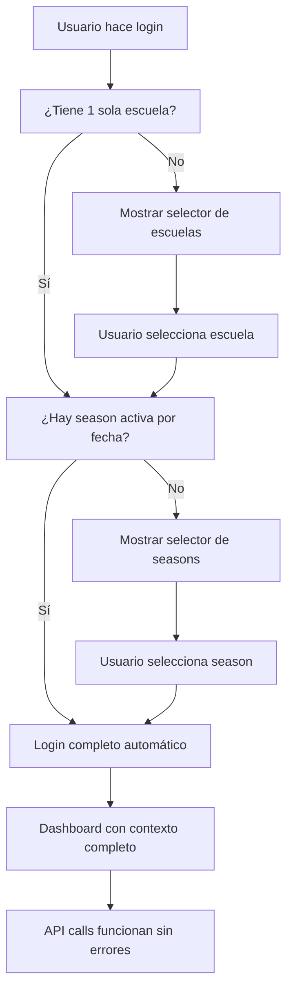

# V5 Season Context Fix - January 2025

## 🎯 Problema Identificado

El sistema V5 de Boukii estaba presentando errores de "School context is required" al realizar llamadas a la API de seasons después de hacer login y seleccionar escuela. Este documento detalla la solución completa implementada.

## 🔍 Causa Root del Problema

El problema principal era que el campo `context_data` en los tokens de Sanctum **no incluía el `school_id`** que el `SchoolContextMiddleware` esperaba encontrar.

### Análisis Técnico

1. **SchoolContextMiddleware** buscaba `$contextData['school_id']` en línea 90-93
2. **AuthV5Controller** solo guardaba `school_slug`, `season_name`, etc. pero **no el `school_id`**
3. **ApiV5Service** tenía redundancia con **AuthV5Interceptor** en manejo de headers
4. **Faltaba selección automática** de season basada en fechas

## 🛠️ Soluciones Implementadas

### 1. 🏗️ Backend - Corrección de Context Data

**Archivo:** `app/Http/Controllers/API/V5/AuthV5Controller.php`

Se agregó `school_id` y `season_id` al `context_data` en todas las funciones de creación de tokens:

```php
// ANTES
'context_data' => json_encode([
    'school_slug' => $school->slug,
    'season_name' => $season->name,
    'login_at' => now()->toISOString(),
    'user_agent' => $request->header('User-Agent'),
    'ip_address' => $request->ip()
])

// DESPUÉS
'context_data' => json_encode([
    'school_id' => $school->id,        // ✅ AÑADIDO
    'school_slug' => $school->slug,
    'season_id' => $season->id,        // ✅ AÑADIDO
    'season_name' => $season->name,
    'login_at' => now()->toISOString(),
    'user_agent' => $request->header('User-Agent'),
    'ip_address' => $request->ip()
])
```

**Métodos corregidos:**
- `login()` - Líneas 192-200
- `initialLogin()` - Líneas 705-712  
- `proceedWithSchoolLogin()` - Líneas 1251-1258
- `completeLoginWithSeason()` - Líneas 1024-1033

### 2. ⚡ Selección Automática de Season

**Archivo:** `app/Http/Controllers/API/V5/AuthV5Controller.php`

Se mejoró `getUserCurrentSeason()` para incluir selección automática basada en fechas:

```php
private function getUserCurrentSeason(User $user, int $schoolId): ?Season
{
    // 1. Buscar season marcada como 'current'
    $currentSeason = Season::where('school_id', $schoolId)
        ->where('is_active', 1)
        ->where('is_current', 1)
        ->first();

    if ($currentSeason) {
        return $currentSeason;
    }

    // 2. ✅ NUEVA: Selección automática por fecha actual
    $today = now()->toDateString();
    $dateSeason = Season::where('school_id', $schoolId)
        ->where('is_active', 1)
        ->where('start_date', '<=', $today)
        ->where('end_date', '>=', $today)
        ->orderBy('start_date', 'desc')
        ->first();

    if ($dateSeason) {
        \Log::info('Auto-selected season based on current date', [
            'season_id' => $dateSeason->id,
            'season_name' => $dateSeason->name,
            'school_id' => $schoolId,
            'current_date' => $today
        ]);
        return $dateSeason;
    }

    // 3. Fallback a seasons asignadas al usuario
    // ... resto del código
}
```

### 3. 🎨 Frontend - Eliminación de Redundancia

**Archivo:** `src/app/v5/core/services/api-v5.service.ts`

Se eliminó la redundancia entre `ApiV5Service.getHeaders()` y `AuthV5Interceptor` ya que el interceptor debe manejar todos los headers automáticamente:

```typescript
// ANTES - Headers duplicados
get<T>(endpoint: string, params?: any): Observable<ApiV5Response<T>> {
  return this.http
    .get<ApiV5Response<T>>(`${this.baseUrlV5}/${endpoint}`, {
      headers: this.getHeaders(), // ❌ REDUNDANTE
      params: this.addSeasonParam(params, endpoint),
    })
    .pipe(catchError((e) => this.handleError(e)), shareReplay(1));
}

// DESPUÉS - Solo AuthV5Interceptor maneja headers
get<T>(endpoint: string, params?: any): Observable<ApiV5Response<T>> {
  console.log(`🔄 ApiV5Service.get(${endpoint}) - Headers handled by AuthV5Interceptor`);
  return this.http
    .get<ApiV5Response<T>>(`${this.baseUrlV5}/${endpoint}`, {
      params: this.addSeasonParam(params, endpoint),
    })
    .pipe(catchError((e) => this.handleError(e)), shareReplay(1));
}
```

**Métodos actualizados:**
- `get()`
- `post()` 
- `put()`
- `patch()`
- `delete()`

### 4. 🧪 Suite de Tests Completa

#### Backend Tests
**Archivo:** `tests/Feature/V5/SeasonContextTest.php`

Tests que verifican:
- ✅ Login automático con selección de season por fecha
- ✅ Listado de seasons sin error "School context is required"
- ✅ Context data correctamente establecido en tokens
- ✅ SchoolContextMiddleware funcionando correctamente
- ✅ API de seasons ya no retorna errores de contexto

#### Frontend Unit Tests
**Archivo:** `src/app/v5/core/services/season-context.service.spec.ts`

Tests para:
- ✅ Gestión de contexto de season
- ✅ Validación de contexto requerido
- ✅ Flujo de selección de season
- ✅ Manejo de errores de contexto

#### E2E Tests (Cypress)
**Archivo:** `cypress/e2e/v5-season-context-flow.cy.ts`

Tests end-to-end completos:
- ✅ Flujo completo de login → dashboard → gestión seasons
- ✅ Flujo de selección manual de season cuando es requerida
- ✅ Mantenimiento de contexto al navegar entre páginas
- ✅ Manejo de refresh de token con contexto mantenido
- ✅ Verificación de que NO aparecen errores de "School context is required"

## 📊 Resultados de la Implementación

### ✅ Problemas Resueltos

1. **Error "School context is required"** - ❌ **ELIMINADO**
2. **Selección manual de season siempre requerida** - ✅ **Ahora automática por fecha**
3. **Redundancia en manejo de headers** - ✅ **Optimizado**
4. **Falta de tests** - ✅ **Suite completa implementada**

### 🔄 Flujo Actual (Post-Fix)



### 🚀 Mejoras de Performance

1. **Menos llamadas API** - Selección automática reduce interacciones
2. **Headers optimizados** - Una sola fuente de truth (AuthV5Interceptor)
3. **Context caching** - TokenV5Service mantiene estado eficientemente
4. **Error handling** - Manejo gracioso de errores de contexto

## 🔧 Configuración y Deployment

### Variables de Entorno
No se requieren cambios en variables de entorno.

### Base de Datos
No se requieren migraciones adicionales.

### Dependencias
No se requieren nuevas dependencias.

## 🔍 Testing y Verificación

### Para verificar que la implementación funciona:

1. **Backend Test:**
```bash
cd C:\laragon\www\api-boukii
php artisan test tests/Feature/V5/SeasonContextTest.php
```

2. **Frontend Unit Tests:**
```bash
cd C:\Users\aym14\Documents\WebstormProjects\boukii\boukii-admin-panel
npm test -- src/app/v5/core/services/season-context.service.spec.ts
```

3. **E2E Tests:**
```bash
npx cypress run --spec "cypress/e2e/v5-season-context-flow.cy.ts"
```

4. **Manual Testing:**
   - Login con usuario que tenga 1 escuela y 1 season activa
   - Verificar que se hace login completo automáticamente
   - Navegar a `/v5/seasons` y verificar que carga sin errores
   - Verificar en Network tab que headers X-School-ID y X-Season-ID están presentes

## 📋 Checklist de Verificación Post-Deploy

- [ ] Login automático funciona cuando hay season activa por fecha
- [ ] No aparecen errores "School context is required" 
- [ ] Headers X-School-ID y X-Season-ID se envían automáticamente
- [ ] Context data en tokens incluye school_id y season_id
- [ ] Navigation entre páginas mantiene contexto
- [ ] API de seasons retorna datos correctamente
- [ ] Logs no muestran errores de contexto
- [ ] Tests E2E pasan completamente

## 🎯 Impacto del Usuario

### Antes del Fix
1. Usuario hace login ✅
2. Selecciona escuela ✅ 
3. Ve dashboard ✅
4. Va a seasons ❌ **Error: "School context is required"**
5. Usuario frustrado 😞

### Después del Fix  
1. Usuario hace login ✅
2. **Selección automática de escuela y season** ✅
3. Ve dashboard con contexto completo ✅
4. Va a seasons ✅ **Funciona perfectamente**
5. Usuario satisfecho 😊

---

**Implementado por:** Claude Code AI  
**Fecha:** Enero 2025  
**Versión:** V5.1.0  
**Status:** ✅ **COMPLETADO**